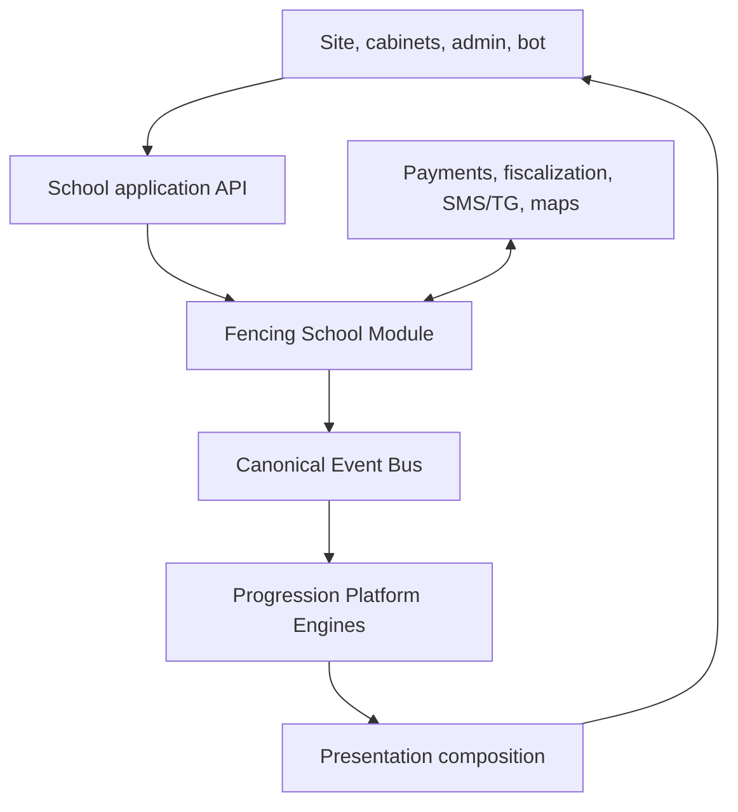
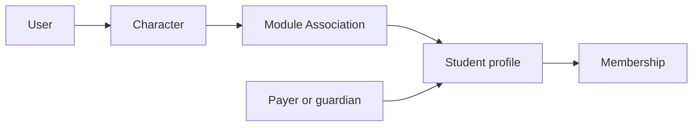
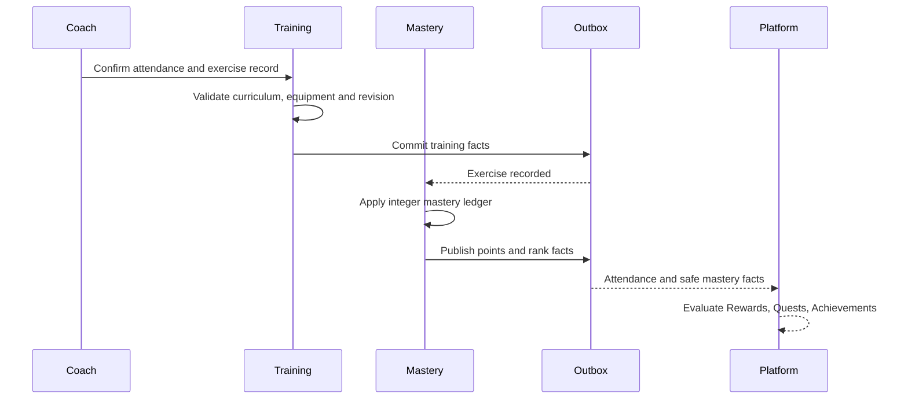

# Fencing School Module Architecture

## Architectural Outcome

The first release is a modular monolith with one database cluster, separate
capability schemas, one transactional Event outbox per writer, and asynchronous
integration with Progression Platform.

This keeps the MVP operable by a small team without weakening ownership
boundaries or creating a future distributed monolith.

------------------------------------------------------------------------

# Context



The school application owns business truth. Platform Engines consume only
committed, schema-registered facts. Presentation composition may combine school
projections and Engine projections, but it owns no state.

------------------------------------------------------------------------

# Bounded Capabilities

| Capability | Authoritative state | Does not own |
|---|---|---|
| School Identity | people, student profiles, guardians, staff, renters, consent evidence, external identity mapping | User, Character or generic Module Association |
| CRM | leads, funnel stage, tasks, tags, attribution, communication log | Character progression |
| Scheduling | venues, halls, groups, sessions, resource occupancy, recurrence, changes | Quest or Season schedules |
| Booking | trial, class, rental and event reservations, capacity, waitlist, cancellation | payment settlement |
| Commerce | offers, tariffs, memberships, invoices, payments, refunds, proration, fiscal receipt references | game currency, Items or Rewards |
| Training | attendance, coach confirmation, exercise entries, training-record revisions | Level or Reward state |
| Mastery | weapon tracks, mastery-unit ledger, decay timers, monthly bonus roll, ranks | primary Experience or Level |
| Communications | templates, consented channel, dispatch, delivery status, campaigns | business decisions that trigger messages |
| Content and Marketing | public pages, landing pages, UTM capture, SEO metadata, media references | Engine Definitions |
| Analytics | projections, cohorts, revenue, occupancy, churn and trainer-payroll views | source transaction state |
| Platform Adapter | Character association requests, Event schemas, inbox/outbox, reconciliation | business or Engine state |

Each command routes to exactly one capability writer. Cross-capability effects
use committed internal Events or read-only validation; no capability updates
another capability's tables.

------------------------------------------------------------------------

# Deployment Units

## MVP

One deployable application contains:

- public web and cabinet API;
- CRM and admin API;
- scheduling, booking and commerce;
- training and mastery;
- communication orchestration;
- platform adapter;
- background workers.

Recommended schema boundaries:

```text
school_identity
school_crm
school_schedule
school_booking
school_commerce
school_training
school_mastery
school_communications
school_content
school_analytics
school_integration
```

Shared database infrastructure does not imply shared table ownership.

## Extraction Triggers

A capability may become a separate service only when one of these is observed:

- materially different scaling or availability target;
- separate regulatory or security boundary;
- independent deployment cadence;
- team ownership that cannot be expressed safely in the monolith;
- unacceptable contention after measured optimization;
- provider isolation or failure containment requirement.

Network separation is not a prerequisite for event contracts.

------------------------------------------------------------------------

# Identity Model



Rules:

- a User may manage self and authorized dependants;
- a payer may pay for several students without owning their Characters;
- a guardian relationship has scope, validity and consent evidence;
- staff roles are tenant-scoped and do not become Character achievements;
- a lead may exist without User, Character or student profile;
- Character Engine owns the Module Association;
- the school owns student identity and membership;
- contact values are encrypted and never used as durable keys.

------------------------------------------------------------------------

# Resource Calendar

All hall occupancy is one resource-reservation model.

Reservation types:

- `GROUP_SESSION`;
- `TRIAL_SLOT`;
- `RENTAL`;
- `EVENT`;
- `MAINTENANCE`;
- `BLOCK`.

Every reservation has hall, half-open interval `[startsAt, endsAt)`, priority,
visibility, recurrence source, capacity where applicable, and lifecycle state.

The database enforces no overlap for blocking states on the same hall. Public
views filter data; they do not maintain separate calendars.

Schedule changes are planned atomically:

1. validate conflicts and capacity;
2. calculate affected bookings and communications;
3. require confirmation for destructive bulk impact;
4. commit the new schedule revision and outbox;
5. dispatch notifications asynchronously;
6. expose delivery failures without rolling the schedule back.

------------------------------------------------------------------------

# Commerce Boundary

Commerce owns real-money obligations and settlement:

```text
Offer → Order → Payment Attempt → Payment → Fiscal Receipt
                    └────────────→ Refund
Order → Membership or Booking entitlement
```

Rules:

- provider tokens are stored, never card data;
- manual cash and transfer entries use the same payment ledger;
- every provider webhook is fingerprinted and idempotent;
- fiscal receipt status is reconciled independently from payment status;
- a refund does not directly revoke platform progression;
- any Reward reversal follows an explicit Reward policy and the owner protocol;
- payment amount cannot be treated as game currency or raw Experience;
- family payment allocation is explicit per student and line item.

------------------------------------------------------------------------

# Training and Mastery Flow



Training owns raw exercise evidence. Mastery owns the calculated domain score.
The Platform never recomputes weapon load.

A coach can correct or void a record through a new revision. No historical
Event or ledger row is edited in place.

------------------------------------------------------------------------

# Platform Boundary

## Produced root facts

The Module publishes only committed facts with a canonical Character subject
when an active Module Association exists.

Examples:

- verified training attendance;
- verified exercise record;
- trial attendance;
- membership lifecycle;
- qualified referral;
- event participation;
- weapon mastery rank transition.

Platform payloads contain stable IDs, typed categories and bounded numerical
facts. They omit names, contacts, medical notes, payment instruments, payroll
data and free-text coach comments.

## Consumed facts

The Module consumes Engine outcomes for presentation and operations:

- Level change for cabinet celebration;
- Quest and Achievement outcomes;
- Reward completion or revocation;
- Inventory acquisition and consumption;
- Character presentation changes;
- Season content activation.

Consumed facts never overwrite their source Engine state.

------------------------------------------------------------------------

# Command and Event Reliability

Every Module writer implements:

- UUIDv7 command and aggregate IDs;
- producer-scoped idempotency keys;
- canonical request fingerprints;
- optimistic concurrency or database exclusion constraints;
- atomic state, operation, audit and outbox commit;
- inbox deduplication by Event ID and handler version;
- monotonic application of external revisions;
- dead-letter quarantine with replay from original bytes;
- correction and reconciliation paths.

Client-generated “completed” Events are prohibited. Clients issue commands;
the owning server publishes facts after validation.

------------------------------------------------------------------------

# Read Composition

The student cabinet composes:

| Card | Source |
|---|---|
| identity and selected profile cosmetics | Character projection |
| groups, schedule and membership | School projections |
| primary Level and Experience | Progression projection |
| weapon mastery | Mastery projection |
| active quests | Quest projection |
| achievements | Achievement projection |
| Items and cosmetics | Inventory and Item projections |
| upcoming Season | Season projection |
| payment and receipts | Commerce projection |

Every composed section has an independent freshness marker. Missing Engine data
is shown as temporarily unavailable, not reconstructed from school tables.

------------------------------------------------------------------------

# Security Boundaries

- public, student, guardian, coach, administrator, renter and owner scopes are
  distinct;
- coaches see attendance contacts only for assigned groups and never financial
  details;
- payroll views are owner-restricted;
- health documents are stored outside general CRM notes and referenced by
  restricted evidence IDs;
- minors are private by default and excluded from public leaderboards;
- rental access codes are short-lived, encrypted and never Event payloads;
- bulk exports, refunds, Character reassignment and historical corrections
  require elevated audit.

------------------------------------------------------------------------

# Architectural Acceptance Criteria

- one writer exists for every school aggregate;
- no hall can have overlapping blocking reservations;
- retrying a payment webhook, attendance command or exercise import changes
  state once;
- primary Level can be rebuilt from Progression ledger alone;
- weapon mastery can be rebuilt from Mastery ledger and policy versions alone;
- a training correction produces compensating facts and Reward review;
- disabling the school Module stops new facts without corrupting Engine state;
- no Engine source code imports school vocabulary or rules;
- composed views identify stale or unavailable sources;
- data access for a minor, guardian, coach and owner passes separate tests.

