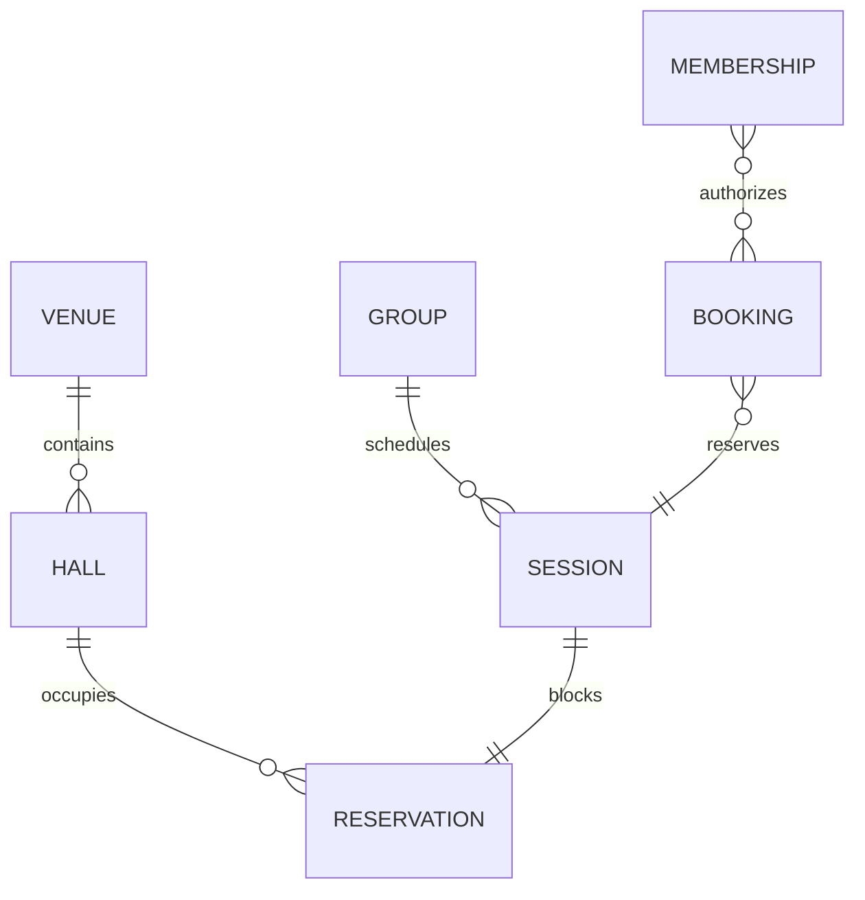

# Domain Model and Events

## Aggregate Ownership

| Aggregate | Owner | Identity and version |
|---|---|---|
| Person | School Identity | `personId`, aggregate version |
| Student Profile | School Identity | `studentId`, aggregate version |
| Guardian Relationship | School Identity | `relationshipId`, aggregate version |
| Lead | CRM | `leadId`, aggregate version |
| Group | Scheduling | `groupId`, aggregate version |
| Session | Scheduling | `sessionId`, schedule revision |
| Resource Reservation | Scheduling | `reservationId`, aggregate version |
| Booking | Booking | `bookingId`, aggregate version |
| Membership | Commerce | `membershipId`, aggregate version |
| Order | Commerce | `orderId`, aggregate version |
| Payment | Commerce | `paymentId`, aggregate version |
| Attendance Record | Training | `attendanceRecordId`, revision |
| Training Record | Training | `trainingRecordId`, revision |
| Equipment Specification | Training | `equipmentSpecId`, immutable version |
| Mastery Account | Mastery | `masteryAccountId`, aggregate version |
| Monthly Bonus Roll | Mastery | `bonusRollId`, aggregate version |

Character, Progression, Reward, Quest, Achievement, Item, Inventory, Talent and
Season aggregates remain owned by their Engines.

------------------------------------------------------------------------

# School Identity Relationships

A `Student Profile` is the school subject for enrollment, attendance and
mastery. It has no contact fields copied from other people by default.

A `Person` may have one or more typed relations:

- self-service student;
- guardian of student;
- payer for student;
- coach;
- administrator;
- renter contact.

A Character Engine Module Association links:

```text
(realmKey=school.fencing, tenantId, externalSubjectType=STUDENT, externalSubjectId=studentId)
    → characterId
```

The school requests association creation. Character Engine publishes
`character.module.association.created.v1` or a rejection.

------------------------------------------------------------------------

# Scheduling Model



A reservation interval is half-open and stored in UTC with an originating time
zone. Recurrence is expanded into concrete reservation instances before
conflict confirmation.

A session cancellation does not delete its reservation history. It transitions
state and may release future occupancy through a new revision.

------------------------------------------------------------------------

# Training Record

A Training Record contains:

| Field | Meaning |
|---|---|
| `trainingRecordId` | stable UUIDv7 |
| `revision` | monotonic record revision |
| `studentId` | school subject |
| `characterId` | canonical Character when actively associated |
| `sessionId` | scheduled session |
| `coachId` | authorized confirmer |
| `occurredAt` | effective training time |
| `curriculumVersionId` | immutable curriculum reference |
| `entries` | structured exercise entries |
| `status` | `DRAFT`, `CONFIRMED`, `CORRECTED`, `VOIDED` |
| `reasonCode` | bounded correction or void category |
| `evidenceRef` | restricted optional reference, never a public URL |

Each exercise entry contains stable exercise code, weapon configuration,
verified equipment version, sets, actions per set, side counts, and source.
Derived mastery units are not editable input fields.

------------------------------------------------------------------------

# Canonical Weapon Taxonomy

| weaponKey | Display name | Legacy aliases |
|---|---|---|
| `spada_a_una_mano` | Spada a una mano / one-handed sword | `spada a uno mano` |
| `due_spade` | Due spade / two swords | none |
| `spada_e_scudo` | Spada e scudo / sword and shield | none |
| `spada_a_due_mani` | Spada a due mani / longsword | none |
| `spadone` | Spadone / two-handed sword | none |
| `ascia_e_alabarda` | Ascia e alabarda / axe or halberd | `acia & alabarda` |
| `spiedo_e_partesana` | Spiedo e partesana / spear or partisan | `spiedo & partesana` |
| `spiedo_e_scudo` | Spiedo e scudo / spear and shield | `spiedo & scudo`, `spiedo and scudo` |

Legacy aliases are accepted only by migration adapters. New commands use the
canonical key.

------------------------------------------------------------------------

# Module Event Catalog

## Identity and enrollment

| Event | Aggregate | Primary consumers |
|---|---|---|
| `school.student.enrolled.v1` | Student Profile | CRM, Reward, Quest, Analytics |
| `school.membership.activated.v1` | Membership | CRM, Reward policy, Analytics |
| `school.membership.renewed.v1` | Membership | CRM, Analytics |
| `school.membership.frozen.v1` | Membership | Scheduling, Mastery timer policy, CRM |
| `school.membership.expired.v1` | Membership | Booking, CRM, Communications |

## Trials and training

| Event | Aggregate | Primary consumers |
|---|---|---|
| `school.trial.booking.created.v1` | Booking | CRM, Communications |
| `school.trial.attendance.recorded.v1` | Attendance Record | CRM, Reward, Quest |
| `school.training.session.completed.v1` | Session | Analytics, Training |
| `school.training.attendance.recorded.v1` | Attendance Record | Reward, Quest, Achievement, CRM |
| `school.training.attendance.corrected.v1` | Attendance Record | Reward review, Quest correction, CRM |
| `school.training.exercise.recorded.v1` | Training Record | Mastery |
| `school.training.record.voided.v1` | Training Record | Mastery reversal and Reward review |

## Mastery

| Event | Aggregate | Primary consumers |
|---|---|---|
| `school.weapon.monthly.bonus.rolled.v1` | Monthly Bonus Roll | Mastery projection, Quest |
| `school.weapon.mastery.points.applied.v1` | Mastery Account | private history, Analytics |
| `school.weapon.mastery.rank.changed.v1` | Mastery Account | Achievement, Reward, profile recognition |

## Commercial and engagement

| Event | Aggregate | Primary consumers |
|---|---|---|
| `school.referral.qualified.v1` | Referral | Reward, CRM |
| `school.event.participation.recorded.v1` | Booking/Attendance | Reward, Quest, Achievement |
| `school.booking.confirmed.v1` | Booking | Scheduling, Communications, Analytics |
| `school.booking.cancelled.v1` | Booking | Scheduling, Commerce, Communications |
| `school.payment.completed.v1` | Payment | Commerce projections and Analytics |
| `school.payment.refunded.v1` | Payment | Commerce projections and Analytics |

Payment Events are not registered as default Experience triggers. Any
commercial Reward requires a separately reviewed policy that does not scale
Experience by amount.

------------------------------------------------------------------------

# Attendance Event Example

```json
{
  "eventId": "01982f2e-7a10-7c91-a3d1-0242ac120101",
  "eventType": "school.training.attendance.recorded.v1",
  "schemaVersion": 1,
  "producer": "fencing-school-module",
  "producerInstance": "fencing-school-module-1",
  "occurredAt": "2026-07-18T17:00:00.000Z",
  "recordedAt": "2026-07-18T18:42:12.345Z",
  "subject": {
    "type": "CHARACTER",
    "id": "01982f2e-7a10-7c91-a3d1-0242ac120102"
  },
  "aggregate": {
    "type": "SCHOOL_ATTENDANCE_RECORD",
    "id": "01982f2e-7a10-7c91-a3d1-0242ac120103",
    "version": 1
  },
  "actor": {
    "type": "USER",
    "id": "01982f2e-7a10-7c91-a3d1-0242ac120104"
  },
  "realmKey": "school.fencing",
  "tenantId": "01982f2e-7a10-7c91-a3d1-0242ac120105",
  "partitionKey": "01982f2e-7a10-7c91-a3d1-0242ac120102",
  "correlationId": "01982f2e-7a10-7c91-a3d1-0242ac120106",
  "causationId": null,
  "lineage": {
    "rootEventId": "01982f2e-7a10-7c91-a3d1-0242ac120101",
    "depth": 0,
    "cycleGuard": []
  },
  "traceId": null,
  "replay": {
    "isReplay": false,
    "replayId": null,
    "originalRecordedAt": null
  },
  "dataClassification": "INTERNAL",
  "payload": {
    "attendanceRecordId": "01982f2e-7a10-7c91-a3d1-0242ac120103",
    "attendanceRevision": 1,
    "studentId": "01982f2e-7a10-7c91-a3d1-0242ac120107",
    "sessionId": "01982f2e-7a10-7c91-a3d1-0242ac120108",
    "groupId": "01982f2e-7a10-7c91-a3d1-0242ac120109",
    "directionKey": "master_of_sword",
    "attendanceStatus": "PRESENT",
    "verificationMethod": "COACH_CONFIRMED"
  },
  "metadata": {
    "contract": "platform-event-envelope.v1"
  }
}
```

No name, contact, health note, payment detail, or free-text coach comment is
included.

------------------------------------------------------------------------

# Training Exercise Event Payload

The payload for `school.training.exercise.recorded.v1` contains:

- `trainingRecordId` and `trainingRecordRevision`;
- `studentId`, `characterId`, `sessionId`;
- `curriculumVersionId`;
- immutable entry IDs;
- `exerciseCode`;
- `weaponConfigurationKey`;
- `equipmentSpecIds`;
- `rightSideSets`, `leftSideSets`, `actionsPerSet`;
- `occurredAt`;
- `verificationMethod`.

The Event may be classified `RESTRICTED` when exact physical-load detail is
included. General platform consumers should receive the safer attendance or
rank outcome Events instead.

------------------------------------------------------------------------

# Correction Semantics

## Attendance correction

A correction:

1. increments `attendanceRevision`;
2. preserves the original record and Event;
3. publishes `school.training.attendance.corrected.v1`;
4. names `priorAttendanceEventId`;
5. includes old and new bounded status plus reason category;
6. triggers Reward, Quest and Achievement correction policy;
7. never edits a previously published Event.

## Training record correction

A corrected record creates a new Training Record revision. Mastery computes the
difference between old and new derived allocations and writes compensating
ledger entries.

A void publishes `school.training.record.voided.v1` and references the exact
record revision. It does not erase audit evidence.

## Late entry

`occurredAt` determines the effective school day. `recordedAt` determines
commit order. Mastery replays affected daily decay and floor transitions from
the earliest changed day. Reward policy declares whether late attendance
remains eligible.

------------------------------------------------------------------------

# Idempotency Identities

| Operation | Domain idempotency key |
|---|---|
| attendance command | `tenantId/sessionId/studentId/attendanceRevision` |
| exercise entry | `trainingRecordId/revision/entryId` |
| provider webhook | provider + provider event ID |
| payment settlement | provider + provider payment ID + operation type |
| booking claim | slot offer ID + claimant ID |
| decay timer | `masteryTrackId/localDate/policyVersion` |
| monthly roll | `masteryAccountId/yearMonth/policyVersion` |
| spreadsheet import | source file hash + sheet + logical row identity |

The same key with a different canonical fingerprint is a conflict.

------------------------------------------------------------------------

# Event Privacy

| Fact type | Default classification | Notes |
|---|---|---|
| enrollment and membership lifecycle | INTERNAL | no contact or price details |
| attendance | INTERNAL | public disclosure disabled |
| exercise detail | RESTRICTED | limited consumers and retention |
| mastery points | RESTRICTED | owner, guardian policy and coach |
| mastery rank | INTERNAL | public only by explicit Character visibility |
| payment | RESTRICTED | platform game consumers disabled by default |
| referral qualification | INTERNAL | no referred person's contact |
| rental access | RESTRICTED | access code never published |

------------------------------------------------------------------------

# Contract Tests

Every Event schema must pass:

- canonical envelope validation;
- producer allowlist;
- UUIDv7 and stable-key validation;
- duplicate delivery;
- same idempotency key with different fingerprint;
- missing Character association;
- late and out-of-order revision;
- correction and void;
- replay with original Event ID;
- tenant isolation;
- restricted-field redaction;
- consumer-driven compatibility.
